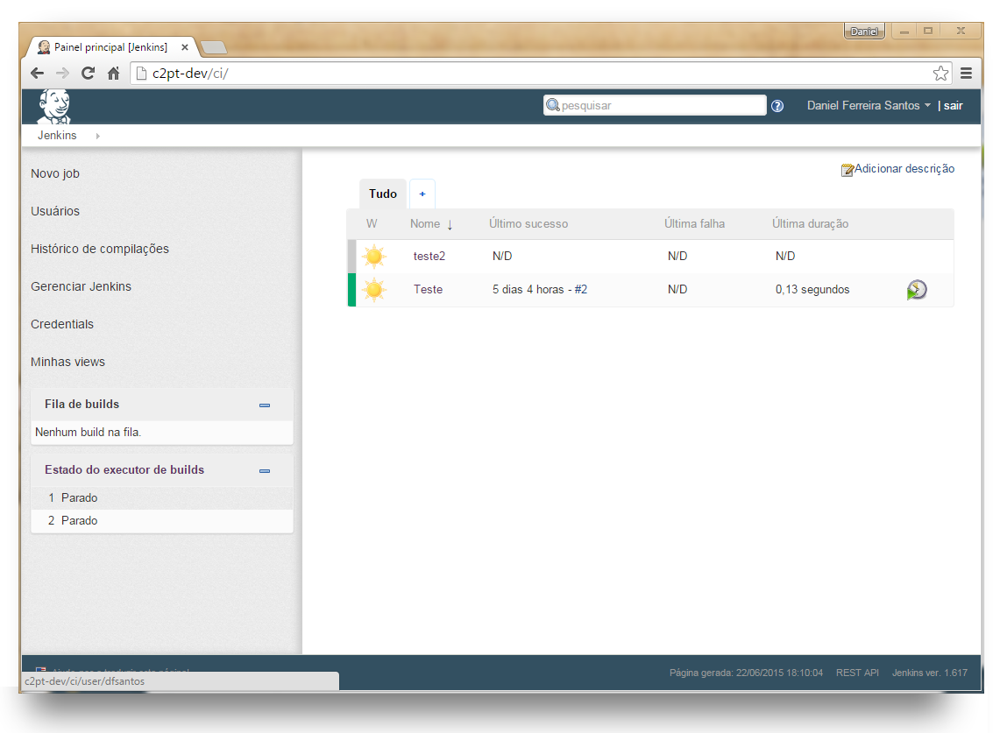

# Jenkins Clean Theme

Compatible with Jenkins UI post-1.572. For pre-1.572, see below.

Last tested with 1.591.

### Before


### After



## URLs

CSS: https://cdn.rawgit.com/artsjedi/clean-jenkins/master/style.css

JS: https://cdn.rawgit.com/artsjedi/clean-jenkins/master/app.js


## Usage

1. Install the [Simple Theme Plugin for Jenkins](https://wiki.jenkins-ci.org/display/JENKINS/Simple+Theme+Plugin)
2. Navigate to Jenkins > Manage Jenkins > Configure System > Theme
3. Set _URL of theme CSS_ to `https://cdn.rawgit.com/artsjedi/clean-jenkins/master/style.css` (or another URL of your setting/choosing)
4. Set _URL of theme JS_ to `https://cdn.rawgit.com/artsjedi/clean-jenkins/master/app.js` (or another URL of your setting/choosing)
 

## To manually change SimpleTheme CSS and JS values

1. Edit: `$JENKINS_HOME/org.codefirst.SimpleThemeDecorator.xml` with code below
2. Restart Jenkins

```
<?xml version='1.0' encoding='UTF-8'?>
<org.codefirst.SimpleThemeDecorator plugin="simple-theme-plugin@0.3">
  <cssUrl>https://raw.githubusercontent.com/artsjedi/clean-jenkins/master/style.css</cssUrl>
  <jsUrl>https://raw.githubusercontent.com/artsjedi/clean-jenkins/master/app.js</jsUrl>
</org.codefirst.SimpleThemeDecorator>
```
